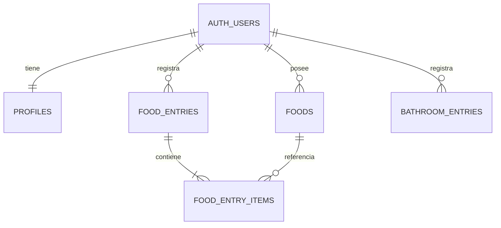

# Modelo de Datos

## Objetivo

El modelo debe permitir registrar eventos de alimentación y evacuaciones
sin acoplar ambos dominios.

Posteriormente, la capa de análisis podrá relacionarlos temporalmente.

## Entidades principales



## profiles

Representa información de aplicación asociada al usuario autenticado.

No sustituye `auth.users`.

Campos principales:

- id
- display_name
- avatar_url
- timezone
- created_at
- updated_at

`id` corresponde directamente a `auth.users.id`.

---

## foods

Catálogo personal de alimentos.

Ejemplos:

- Café
- Leche
- Arroz
- Frijoles
- Salsa roja
- Tacos al pastor

Un alimento representa una identidad reutilizable para análisis.

Por ello no debemos almacenar simplemente el nombre de la comida
como texto libre en cada registro.

Campos:

- id
- user_id
- name
- category
- default_unit
- is_favorite
- archived_at
- created_at
- updated_at

### Archivado

Los alimentos utilizados históricamente no se eliminan físicamente.

Se utiliza:

`archived_at`

Esto evita romper registros y análisis antiguos.

---

## food_entries

Representa un evento de alimentación.

Ejemplo:

> Comida del 6 de octubre a las 14:30.

Campos:

- id
- user_id
- eaten_at
- meal_type
- notes
- created_at
- updated_at

No representa un alimento individual.

---

## food_entry_items

Representa los alimentos que forman parte de un `food_entry`.

Ejemplo:

Comida:

- arroz
- pollo
- salsa
- tortilla

Cada uno constituye un item.

Campos:

- id
- user_id
- food_entry_id
- food_id
- quantity
- unit
- sort_order
- notes
- created_at
- updated_at

Esto permite que un único evento de comida contenga múltiples alimentos.

---

## bathroom_entries

Representa una evacuación.

Campos:

- id
- user_id
- occurred_at
- bristol_type
- urgency
- pain_level
- notes
- created_at
- updated_at

### Bristol

Rango:

1 a 7.

### Urgencia

Escala inicial:

0 a 4.

### Dolor

Escala inicial:

0 a 4.

Los valores deben almacenarse como números estructurados.

No deben calcularse a partir de texto libre.

---

# Integridad entre usuarios

`food_entry_items` contiene explícitamente `user_id`.

Aunque pueda parecer redundante, esto permite:

1. aplicar RLS directamente;
2. indexar por usuario;
3. impedir relaciones cruzadas entre usuarios;
4. simplificar consultas;
5. auditar propiedad de los datos.

Las claves foráneas compuestas garantizan que:

```text
food_entry
food
food_entry_item
```

pertenezcan siempre al mismo usuario.

---

# Tiempo

Los eventos utilizan:

`timestamptz`

La zona horaria preferida del usuario se almacena en:

`profiles.timezone`

La aplicación convierte la representación visual a la zona horaria
correspondiente.

---

# Identidad estadística

La identidad de un alimento es su:

`food_id`

no su nombre.

Esto significa que corregir:

`Cafe`

a:

`Café`

no rompe el historial estadístico.
